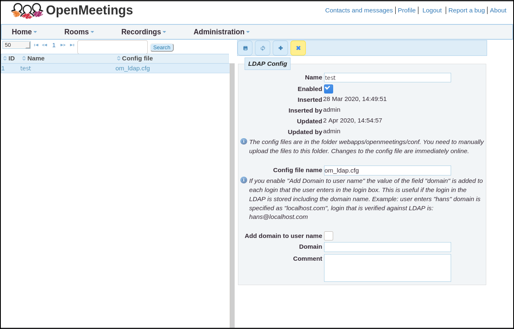

<!--
Licensed under the Apache License, Version 2.0 (the "License") http://www.apache.org/licenses/LICENSE-2.0
-->

# LDAP and Active Directory Integration

This manual explains the configuration to use an already existing
(e.g. corporate or university) LDAP/AD Server for user authentication
into OpenMeetings. Successful integration has also been reported with
Novell eDirectory.

For installation and setup instructions of an LDAP server itself see
https://help.ubuntu.com/lts/serverguide/openldap-server.html

## LDAP Configuration in OpenMeetings

To configure access to an LDAP Server, three things are needed:

### 1. Information how to access the LDAP Server for user lookup

-   Obtain the ip address and port number of the LDAP server. For the
    example configuration in the next section we will use the ip
    address 10.8.0.10 and the default LDAP port number 389.

-   A single LDAP user account is needed that has read privileges to the
    user entries that are to be used for login by OpenMeetings. Often
    these accounts have the organizational unit attribute
    `ou=system-users`.

-   Obtain the cn and password of that user from the LDAP
    administrator. For the example configuration we will use
    `cn=openmeetings` and `password=12345`.

-   Obtain the dc values of the root of the LDAP database. In our
    example we will use `dc=mydomain,dc=org`.

### 2. An LDAP config file

-   This file needs to be located in the folder
    `$OM_HOME/webapps/openmeetings/data/conf/` <sup><a id="fnr.1" class="footref" href="#fn.1">1</a></sup>.
    An example file called `om_ldap.cfg` should come with your
    OpenMeetings installation.

-   The file needs to contain the access information obtained in the
    previous section. For our example the file would contain the
    following:

    ```
    ldap_conn_host=10.8.0.10
    ldap_conn_port=389
    ldap_conn_secure=false

    # The following lines specify the data of the ldap user with
    # read privileges to the user entries according to the LDAP DB.
    ldap_admin_dn=cn=openmeetings,ou=system-users,dc=mydomain,dc=org
    ldap_passwd=12345

    # The following line specifies where to search for users wanting to login
    ldap_search_base=ou=users,dc=mydomain,dc=org

    # The attribute in the LDAP DB which will be matched against the
    # given login data ("Username or mail address" field) in OpenMeetings:
    ldap_search_query=(uid=%s)

    # the scope of the search might be: OBJECT, ONELEVEL, SUBTREE
    ldap_search_scope=ONELEVEL

    # Ldap auth type(NONE, SEARCHANDBIND, SIMPLEBIND)
    #  When using SIMPLEBIND a simple bind is performed on the LDAP server to check user authentication
    #  When using NONE, the Ldap server is not used for authentication
    ldap_auth_type=SIMPLEBIND

    # userDN format, will be used to bind if ldap_auth_type=SIMPLEBIND
    # might be used to get provisionningDn in case ldap_auth_type=NONE
    ldap_userdn_format=uid=%s,ou=users,dc=mydomain,dc=org

    # Ldap provisioning type(NONE, AUTOCREATE, AUTOUPDATE)
    ldap_provisioning=AUTOCREATE

    # Ldap deref mode (never, searching, finding, always)
    ldap_deref_mode=always

    #  Set this to 'true' if you want to use admin_dn to get user attributes
    #  If any other value is set, user_dn will be used
    ldap_use_admin_to_get_attrs=true

    # Ldap-password synchronization to OM DB
    #  Set this to 'true' if you want OM to synchronize the user Ldap-password to OM's internal DB
    #  If you want to disable the feature, set this to any other string.
    #  Defautl value is 'true'
    ldap_sync_password_to_om=true

    # Ldap group mode (NONE, ATTRIBUTE, QUERY)
    # NONE means group associations will be ignored
    # ATTRIBUTE means group associations will be taken from 'ldap_group_attr' attribute (M$ AD mode)
    # QUERY means group associations will be taken as a result of 'ldap_group_query' query
    ldap_group_mode=NONE

    ldap_group_query=(&(memberUid=%s)(objectClass=posixGroup))

    # Ldap user attributes mapping
    # Set the following internal OM user attributes to their corresponding Ldap-attribute
    ldap_user_attr_login=uid
    ldap_user_attr_lastname=sn
    ldap_user_attr_firstname=givenName
    ldap_user_attr_mail=mail
    ldap_user_attr_street=streetAddress
    ldap_user_attr_additionalname=description
    ldap_user_attr_fax=facsimileTelephoneNumber
    ldap_user_attr_zip=postalCode
    ldap_user_attr_country=co
    ldap_user_attr_town=l
    ldap_user_attr_phone=telephoneNumber
    # optional attribute for user picture
    #ldap_user_attr_picture=
    ldap_group_attr=memberOf

    # optional, absolute URL will be used as user picture if #ldap_user_attr_picture will be empty
    #ldap_user_picture_uri=picture_uri

    # Ldap ignore upper/lower case, convert all input to lower case
    ldap_use_lower_case=false

    # Ldap import query, this query should retrieve all LDAP users
    ldap_import_query=(objectClass=inetOrgPerson)

    ```

    NOTE: Directory Servers are individual for every organization, and
    might use different attribute names than the ones listed in the
    example config. Please obtain the information about the structure
    and attribute names of the entries and adjust the config file
    accordingly.

    It is important to configure LDAP_SEARCH_PATH so that it points to the
    node of the LDAP directory server that contains the users.

    If there are multiple search paths you can either try to define a
    search path that points to multiple nodes or define multiple LDAP
    configurations in the LDAP administration pane of OpenMeetings.

### 3. Configuring OpenMeetings to use the ldap config file

The final step binds the config file of the previous section to
OpenMeetings:

-   Log into OpenMeetings as Administrator

-   Open Administration->LDAP

    </img>

-   In the right pane of the main window labeled "LDAP Config" set
    the Name of the LDAP DB which you want to appear in the popup
    menu right of the "Domain" label of OpenMeeting's login
    screen. Any Name can be set here.

-   Check the "Enabled" checkbox to make the LDAP DB available on the
    login screen.

-   Fill in the field "Config file name" with the file name of the
    config file from the previous section of this manual (just the
    file name, without it's path).

-   Save the Configuration by clicking in the save icon above the
    "LDAP Config" label and load this setting by clicking in the
    reload icon right of the save icon.

-   The table in the left pane of OpenMeeting's LDAP administration
    window should contain an entry with the ID (autoassigned by
    OpenMeetings), name and config file.

Test the settings by logging out of Openmeetings and logging back in
with a user and password of the LDAP DB. Make sure you select the
configured name of the LDAP DB in the "Domain" popup menu of the Login
screen before pressing the "Sign in" button. If login doesn't work,
see the section [Troubleshooting](#ldap-troubleshooting)

## Additional (optional) steps

Once login with users from the LDAP DB works, all users of that
database can get imported into OpenMeetings internal table of users
using the command line tool "admin.sh":

-   First test with:

    `$OM_HOME/admin.sh -l -d1 --print-only`

    The argument of the `-d` ("domain-id") flag indicates the ID number
    of the LDAP DB in the LDAP table on the left pane in OpenMeeting's
    Administration->LDAP configuration. If only one LDAP DB is
    configured there the ID most probably is 1.

    `--print-only` indicates that the entries shouldn't actually get
    imported, but rather printed out on the terminal.

    If everything works as expected, a lot of printout should happen
    on the terminal with the user entries of the LDAP DB appearing
    last.

-   In that case the entries can actually get imported into
    OpenMeetings by omitting `--print-only`:

    `$OM_HOME/admin.sh -l -d1`

After import they can be found in the OpenMeeting website at
appopriate places (Invitation into rooms, in the Administration
pages of Users, Groups and Conference rooms, etc.).

NOTE: It is not strictly necessary to import all users from the LDAP
DB: Any user who logs into OpenMeeting for the first time will be
added to OpenMeeting's Users table. For administrative purposes it
can nevertheless be very convenient to import all users of an LDAP
DB in order to distribute them to different Groups/Rooms without
requiring each of them to log in first.

<a id="ldap-troubleshooting" href="#ldap-troubleshooting"></a>

## Troubleshooting

In case login doesn't work it is recommended to turn on verbose
logging:

- stop OM

- add the following line to `$OM_HOME/webapps/openmeetings/WEB-INF/classes/logback-config.xml`:

    `<logger name="org.apache.directory" level="DEBUG" />`

- restart OM

- Try to log in using the configured LDAP DB and try to debug the
  problem by checking the log file. By default, logging is done to the
  file `$OM_HOME/logs/catalina.out`.

## Footnotes

<sup><a id="fn.1" href="#fnr.1">1</a></sup> `$OM_HOME` is the
home folder of the OpenMeetings installation, e.g. `/opt/open503`
